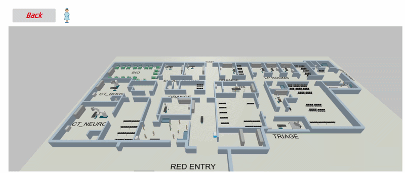
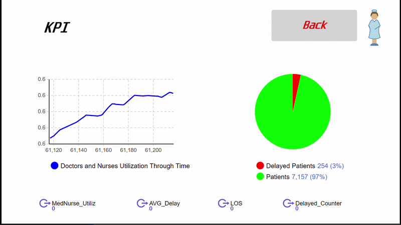

# Discrete Event Simulation of Emergency Department Operations: Fast-Track Implementation

## Project Overview
This repository serves as a Visual and Analytical Portfolio for a Discrete Event Simulation (DES) digital twin developed for the Emergency Department of a Metropolitan Hospital. The model, engineered using AnyLogic, aims to support data-driven decision-making and provide a rigorous evaluation of operational strategies. The primary objective is the resolution of severe bottlenecks at the triage stage. By reproducing the complex stochastic dynamics of the department—including variable patient arrivals, resource constraints, and diverse clinical pathways—this project assesses the operational impact of introducing a 'Fast-Track' policy dedicated to low-acuity patients.

## Simulation Visuals
The following captures demonstrate the environmental modeling and the dynamic generation of Key Performance Indicators (KPIs) during virtual-time execution. *(Note: Proprietary logical workflows and raw patient datasets have been intentionally omitted to protect intellectual property).*

**1. 3D Environmental Simulation**  

**2. Dynamic KPI Dashboard (Virtual Time)**  

## Simulation Architecture
The simulation architecture was designed to faithfully replicate both the physical layout and the logical patient workflow of the Emergency Department. Patient entities enter the system according to empirically derived arrival distributions and are processed through a triage prioritization system. Based on their assigned severity level, patients are routed to specific care pathways, with high-acuity patients arriving via ambulance and bypassing standard queues.

The core structural intervention modeled is the 'Fast-Track' policy, which creates a segregated workflow for low-acuity cases. The logic incorporates state transitions, probability of patient condition deterioration during waiting periods, and the dynamic allocation of shared resources (physicians, nurses, and diagnostic equipment). By explicitly isolating the low-acuity flow into a dedicated pathway, the simulation demonstrates the preservation of critical resources for severe cases and the mitigation of systemic congestion.

## Statistical Validation (ANOVA)
To validate the efficacy of the proposed interventions, a full factorial experimental design was conducted, generating 16 scenarios with 8 replications each to account for stochastic variability. The results were analyzed using Analysis of Variance (ANOVA) in Minitab with a 95% confidence level (p-value < 0.05). 

The statistical analysis confirmed the robust efficacy of the Fast-Track implementation:
*   **Length of Stay (LOS):** The introduction of the Fast-Track pathway yielded a statistically significant reduction in the mean LOS by 11.82% (decreasing from 103.610 to 92.659 minutes).
*   **Queue Management:** The maximum queue length (peak congestion) experienced a dramatic reduction of 38.11% (from 15.537 down to 11.250 patients), establishing flow segregation as a highly effective bottleneck resolution strategy.
*   **Resource Utilization:** By diverting the low-acuity workload, the Fast-Track policy provided immediate relief to core staff, reducing the overall resource utilization rate by 16.70% (from 0.622 to 0.533) without compromising throughput.
*   **System Vulnerability:** The analysis also proved that a 10% surge in patient arrivals (High Intensity) worsens the baseline LOS by 8.32%, underscoring the necessity of the Fast-Track system to absorb demand shocks.

## Scientific Publications
The methodology, theoretical framework, and extended statistical findings of this simulation architecture have been formally published. For a comprehensive analysis of the research, please refer to the following peer-reviewed articles:

* **[Modeling Emergency Departments with Discrete Event Simulation: A Systematic Review of Underexplored Dimensions]**  
  *Published in: [Procedia Computer Science, 2025]*  
  DOI: [[https://doi.org/10.1016/j.procs.2025.12.112])

* **[Discrete Event Simulation of Emergency Department Operations: A Case Study in an Italian Hospital]**  
  *Published in: [Procedia Computer Science, 2026]*  
  DOI: [[https://doi.org/10.1016/j.procs.2026.02.423])

## Project Collaborators
This research and architecture development was conducted in collaboration with:
* **Giuseppe Emanuele Ferro**  
  
